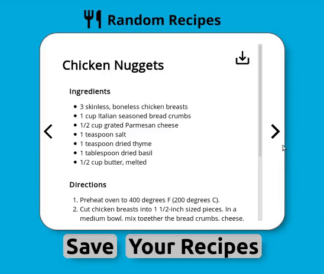

# Random Recipes

A javascript application made with HTML, CSS and vanilla Javascript. It allows you to browse random recipes, and save those you like. You can also download recipes as a .txt file. Your saved recipes are stored in local storage, and can be managed in “Your Recipes”.

## How to Run

Extract the zip file the open the **index.html**

## License

This project is licensed under the MIT License - see the [LICENSE](LICENSE) file for details